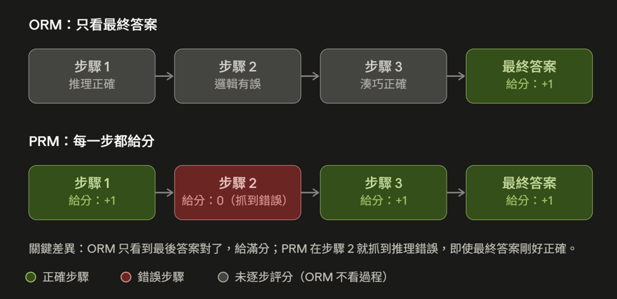

# Day12 獎勵機制的抉擇：Outcome vs Process Reward Model 與可驗證獎勵

昨天提到關於Credit Assignment的解法有Process Reward Model跟RLVR，今天我們先來聊聊Process Reward Model~
 

### Outcome Reward Model（結果獎勵模型，ORM）
ORM 只評估最終輸出的正確性或品質，不管過程中的細節。它只針對最終輸出打一個分數，整個生成過程只有這一個數字

### Process Reward Model（過程獎勵模型，PRM）
PRM 是一種對 LLM 的多步推理過程給予逐步、細粒度評估與監督的模型。

PRM 會對解題軌跡中的每一個中間步驟都給予獎勵訊號。這代表 PRM 能抓到「答案對，但過程是矇對的」或「過程正確，但最後粗心算錯」這種情況。

昨天提到Credit Assignment，也就是只看最終結果會導致模型不知道哪一步做錯。所以我們應該從「只看最終結果 (Outcome)」轉變為「對每一個中間步驟打分 (Process)」，過程需要被評分。所以我們會需要Process Reward Model。

但昨天也有提到Process Reward Model就是多訓練一個模型，專門對每一個中間步驟打分，這樣又會出現一個問題:額外訓練一個 PRM 的成本。

---
於是就有了RLVR這個方法
### RLVR（Reinforcement Learning with Verifiable Rewards)

- RLVR是一種訓練LLM的強化學習框架
- 獎勵函數不依賴人類回饋，而是由決定性規則自動判斷模型輸出的正確性，給出二元訊號（正確給 1，錯誤給 0）

- RLVR 的完整訓練迴圈：
> Prompt → policy 生成答案 → 驗證器規則比對 → 產生 0/1 獎勵 → GRPO 更新參數
> 
>反覆這個迴圈直到模型收斂

整個過程中，沒有任何一步需要人類坐在螢幕前打分，這正是 RLVR 相對 RLHF 最省成本、也最不容易被「討好裁判」鑽漏洞的地方。

註：此處以近期大熱的 GRPO 為例，但 RLVR 同樣適用於 PPO 等演算法

---
### Takeaway
- RLVR用「決定性規則」自動判斷模型輸出對錯，取代 RLHF 中昂貴又主觀的人類評分

---

今天我們從 ORM、PRM 一路聊到 RLVR，了解「怎麼給獎勵」會直接影響模型學習的方向。

但對 Agent 來說，光有好的獎勵函數還不夠。Agent 能做什麼、怎麼與環境互動、成功與失敗如何被判定，往往才是決定訓練成敗的關鍵。

明天我們就來看看：**為什麼環境設計可能比選 PPO、GRPO 還重要？** 以及一個好的 Agent RL 環境，究竟需要具備哪些條件？
