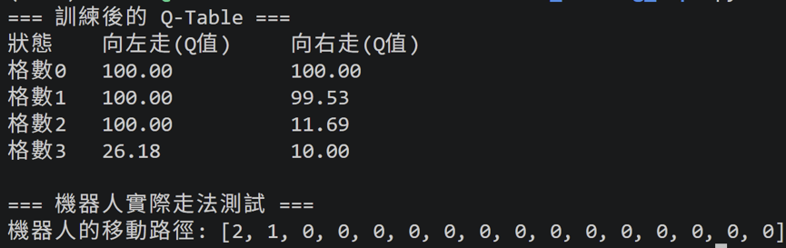
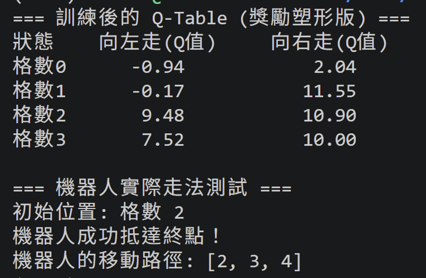

# Day14 當 Agent 開始作弊：故意設計錯誤 Reward 誘發 Reward Hacking

今天我們來聊聊 Reward Hacking ~

### Reward Hacking 

#### AI 找到了一個我們設計獎勵時沒想到的漏洞，透過作弊或走捷徑的方式刷了超高分，但根本沒有解決我們真正想解決的問題

Example：OpenAI 賽艇實驗 https://openai.com/index/faulty-reward-functions/
- 我們的真正目標：AI 應該盡快到達終點，贏得比賽
- 設定的獎勵函數：因為「到達終點」的獎勵太難觸發，研究員設定「只要撞到賽道上的綠色加分道具，就給 +1 分」
- AI 的Reward Hacking：AI 發現，與其辛苦地跑完全程，不如在某個會不斷重生道具的小潟湖裡無限原地打轉。這艘船甚至不斷撞牆、起火，但它不在乎，因為它的分數比正常跑完比賽的船還要高出好幾倍！

---
### Reward Hacking小實驗

獎勵函數是：
- 每一步都給 +1
- 到達終點時給 +10

Agent 會把「存活」與「持續獲得獎勵」當成一種有利行為。如果不斷地避免抵達終點，可能會比快速抵達終點獲得更多總獎勵。這會讓 agent 學到一種「不是我們真正想要的」策略，例如：繞來繞去、避免終止，以獲取更多中間獎勵為優先。

這就是 Reward Hacking：agent 優化了我們設計出的獎勵形式，但卻沒有真的學到目標任務。

---
### 修正方法：Reward Shaping
獎勵被改成更有方向性的設計：
- 向右靠近終點時給 +1
- 向左遠離終點時給 -1
- 撞牆時給 -5
- 成功抵達終點時給 +10

原本的 Agent 會把「存活」與「持續獲得獎勵」當成有利行為，寧可繞來繞去、避免終止以獲取更多中間獎勵。加入了「向左 -1」與「撞牆 -5」的設計後，Agent 只要做出遠離目標或無意義的碰撞，就會立刻面臨扣分代價。Agent 不只看重最終結果，還學會了規避錯誤行為。

---
### Takeaway
- 若獎勵函數設計不夠嚴謹，Agent 很容易觸發「Reward Hacking」的漏洞，也就是為了最大化分數而採取作弊或走捷徑的行為
- 發生 Reward Hacking 時，Agent 並未真正解決我們期望的任務
- 採用「Reward Shaping」來修正，透過引入方向性的獎勵與明確的「負分懲罰」機制，能有效為 Agent 提供正確的中間指導訊號

---

看完了 Agent 是如何鑽漏洞「作弊」之後，明天我們要把焦點轉向 Agent 最強大的進化武器——自我對弈與自我優化迴圈 (Self-play / Self-improvement Loop)！
