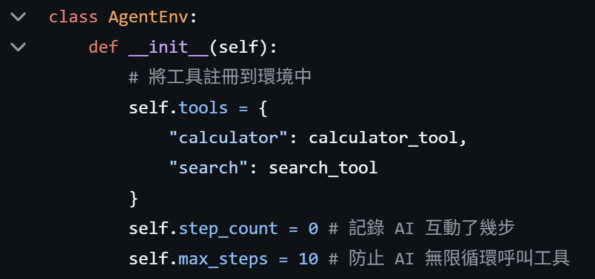
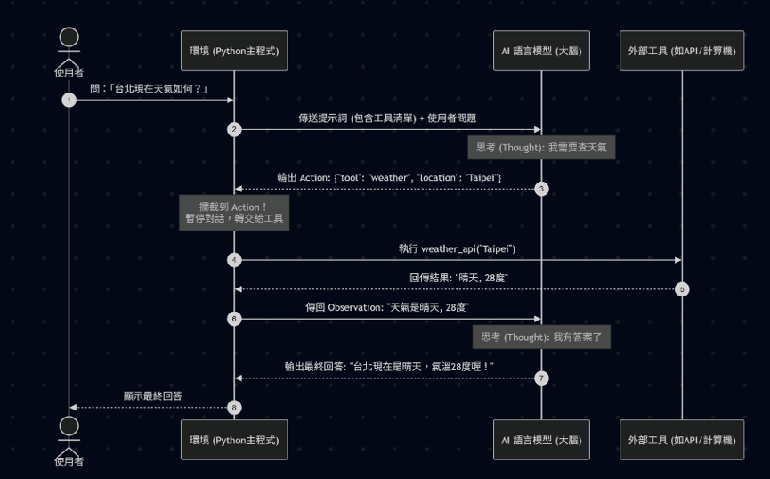
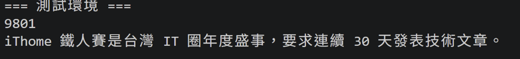

# Day16 打造 Agent 競技場：手刻工具呼叫環境與評估資料集建立

今天要開始實作了，首先要先建立環境以及 Evaluation Dataset。

### 環境是什麼?

#### 環境（Environment）
工具呼叫環境是連接 AI 語言模型與外部世界的橋樑，負責執行 AI 想做的動作並回傳結果。
 
LLM本身只是一顆沒有手腳的「純大腦」，它無法上網查資料，也不一定能算對複雜數學。我們寫的「環境」，就像是這顆大腦的「手與眼睛」。當 AI 決定要用工具時，環境會攔截這個指令，幫它按鈕執行，再把螢幕上的「結果（Observation）」傳回給 AI 繼續思考。

---
實作

實作兩個小工具: calculator 與 search
- calculator_tool(expression)：簡易計算機，直接計算算式
- search_tool(query)：模擬搜尋引擎，根據關鍵字回傳簡短知識

---
### Evaluation Dataset
評測資料採用 JSON list，每一筆任務都包含：

- id：任務編號
- task：給代理人的自然語言題目
- expected_tool：預期應使用的工具，可以是單一工具或工具序列
- expected_answer：標準答案或期望輸出

---
### Agent與外部工具互動的底層邏輯
LLM是只有文字輸入與輸出的純大腦。它沒有連網能力、也不會算數學。我們要讓它能使用工具，必須做到三件事：

- **給予說明書**：在系統提示詞裡清楚告訴大腦「有什麼工具可以呼叫」，以及「呼叫的格式是什麼（通常是 JSON）」。
- **攔截與執行**：大腦思考後吐出一段要求使用工具的 JSON 文字。我們寫的外部程式（稱為環境 Environment）會攔截這段文字，將文字轉換成真正的 Python 函式執行（例如發送 HTTP 請求或執行加減乘除）。
- **回傳結果**：外部程式把執行完的數字或資料，再次轉成純文字，當作對話紀錄（Observation）傳回給大腦。大腦讀到結果後，再繼續生成最終回答。

這個最經典的架構稱為 **ReAct（Reasoning and Acting，推理與行動）** 

今天的目標是把Agent的基礎架構搭好，並建立好評估資料集，為後續的訓練鋪路。

---
### 代理人和環境的互動流程
1. 讀取任務題目
2. 判斷要呼叫哪個工具
3. 將工具名稱與輸入送進 `AgentEnv.step()`
4. 環境執行工具後回傳結果
5. 代理人根據 observation 決定下一步，直到完成任務或達到步數上限

---
`例子`

---
實作結果

https://github.com/crazyainfuture/AI-Agent-RL/tree/master/agent_project

---
### Takeaway
- 建立環境
- 註冊工具
- 建立測試集

---

資料準備好後，明天會完成評估腳本，並載入純 SFT 模型（Baseline）讓它試寫這份考卷，建立起 RL 訓練前的重要基準點。