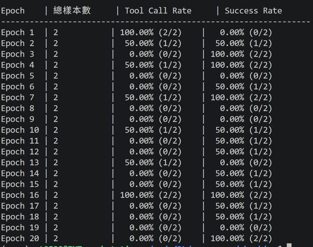

# Day19 Reward 第二版修正

今天會修正reward function，並看看是否避免發生 reward hacking 的發生。最後進行一個小型參數的比較。

### 第二版 Reward 設計 (Reward v2)
Reward Function 修改策略:
把模型的行為拆分為「格式正確性」、「結構合法性」與「任務完成度」等不同層級進行評分。

#### 1.	在最外層進行輸出格式檢查。
模型只能選擇「直接回答」或「呼叫工具」其中一種行為，若同時出現兩種格式，或兩種格式皆未出現，直接給予 -0.5 的懲罰，避免模型產生不符合規範的輸出。
#### 2.	若模型選擇直接回答，首先給予 +0.2 的基本格式獎勵。接著進一步檢查答案是否包含正確答案。

- 只有答對才能額外獲得 +2.0，最終達到 +2.2 的高獎勵。
- 若格式正確但答案錯誤，則 -0.3，使最終分數為 -0.1。因此，模型無法僅靠輸出 <final_answer> 標籤取得正向收益，而必須真正解決問題。
#### 3.	若模型選擇使用工具，則採用三階段評分。
- 正確使用 <tool_call> 格式可獲得 +0.2；接著檢查 JSON 是否能成功解析，成功再獲得 +0.2；最後根據問題內容判斷工具選擇是否合理，例如計算問題應使用 Calculator，天氣問題則應使用 Weather API 或 Search。若工具選擇符合問題情境，額外獲得 +1.6，最高可達 +2.0。

- 若工具選擇錯誤或 JSON 格式無法解析，則透過負向獎勵將總分壓至 -0.1 左右，降低模型刷分的可能性。

這套reward function設計成「格式正確 → 結構合法 → 行為合理 → 任務完成」的獎勵階梯。其中，格式與 JSON 只提供少量獎勵，而正確答案或正確工具選擇才是主要獎勵來源。透過讓「格式對但內容錯」的結果低於 0 分，可以避免模型為了追求容易取得的格式分而放棄真正解題，進一步降低 Reward Hacking 所造成的策略崩潰。

#### 實驗結果

---
### Takeaway
- 修改後的 Reward Function 成功解決 reward hacking的問題，迫使模型放棄投機取巧的策略，轉而真正去學習並解決問題。

---

既然設計 reward function 這麼麻煩又容易被模型鑽漏洞，有沒有其他方法可以不需要自己刻 reward function？有的，明天我們就來聊聊 DPO～

