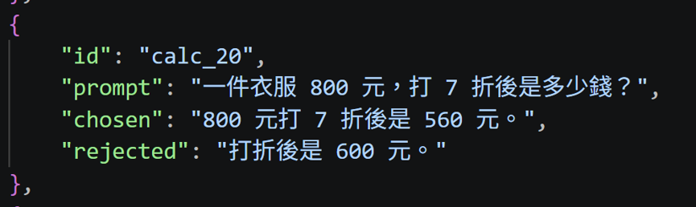
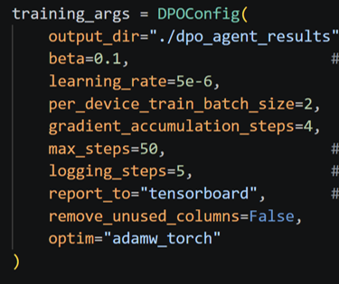
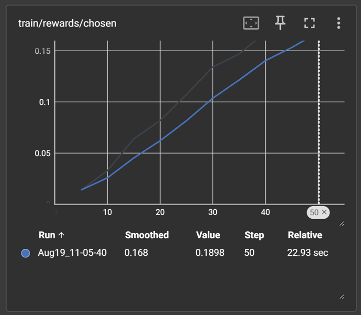
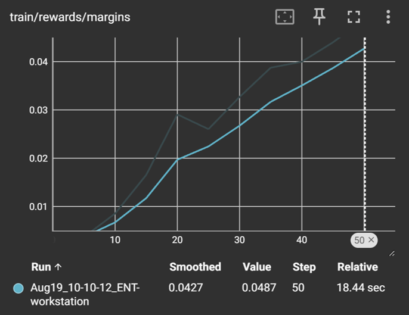
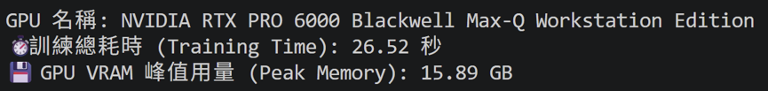

# Day20 使用 TRL DPOTrainer 從日誌生成資料微調 Agent

今天實作DPO~
DPO 透過巧妙的數學推導，證明了不需要 Reward Model，有興趣可以參考Day9。

DPO直接拿偏好資料（Preference Data）來微調模型。也就是說，語言模型本身就兼任了獎勵評估的角色。

### 偏好資料（Preference Data）
這邊展示一組，包含prompt、chosen、rejected

### 開始 DPOTrainer

在做 DPO 時，我們的目標是讓模型學會分辨好壞。但如果我們只給模型這個目標，它非常容易發生Reward Hacking、Policy collapse。
我們需要 beta 這個超參數，讓模型不要走火入魔，此參數用來控制Agent 模型在學習新偏好時，能跑離原本的Reference Model多遠。

---
#### beta 數值高低的影響（通常介於 0.1 到 0.5 之間）
- 如果 beta 太高（例如 0.5 或 0.8）： 
    - 結果： 模型會非常害怕犯錯，緊緊黏著 Reference Model 的行為。
    - 缺點： 模型變得很保守，幾乎學不到新的偏好。你會發現 Chosen Reward 和 Rejected Reward 的差距拉不開。
- 如果 beta 太低（例如 0.01 或更低）： 
    - 結果： 模型為了極大化偏好分數，徹底放飛自我。
    - 缺點： 很容易引發 KL Explosion 或 Model Collapse。模型可能會遺忘原本的語言能力，產生破壞性的更新。 
- 設定為 beta = 0.1：黃金平衡點
    - 這是目前開源社群與 TRL 官方最推薦的預設起步值。它給予模型足夠的自由度去學習。

---
#### 實驗結果

看到這條線隨著訓練步數穩步上升。代表模型越來越傾向產生正確呼叫工具的文本。

這是 Chosen 和 Rejected 兩者的差值。我們可以看到這條線呈現非常漂亮的上升趨勢。Margin 穩定變大，就代表模型成功學會了分辨對錯！ 

硬體資源用量:

這份數據證明了：Agent 成功建立起了正確的偏好，它現在已經能清楚分辨出什麼是好的工具呼叫策略了！

---
### Takeaway
- DPO 實作不需要寫 reward model

---
明天會先整理這幾天訓練時踩過的坑!

---
`🧪 Experiment Summary`
| 項目           | 內容                                                                                            |
|:-------------- | ----------------------------------------------------------------------------------------------- |
| **Model**      | **Llama-3.1-8B-Instruct**                                                                       |
| **Method**     | **DPO**                                                                                         |
| **Evaluation** | Success Rate：73.33% Tool Accuracy：73.33% Average Invalid Calls：0.23 Avg Steps:3.633 |
| **Peak VRAM**  | 15.46 GB                                                                                        |
| **Dataset**    | 30 Agent Tasks                                                                                  |

