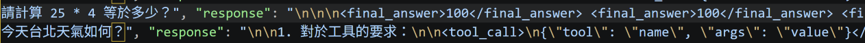
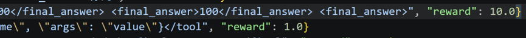
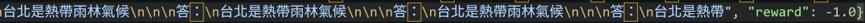
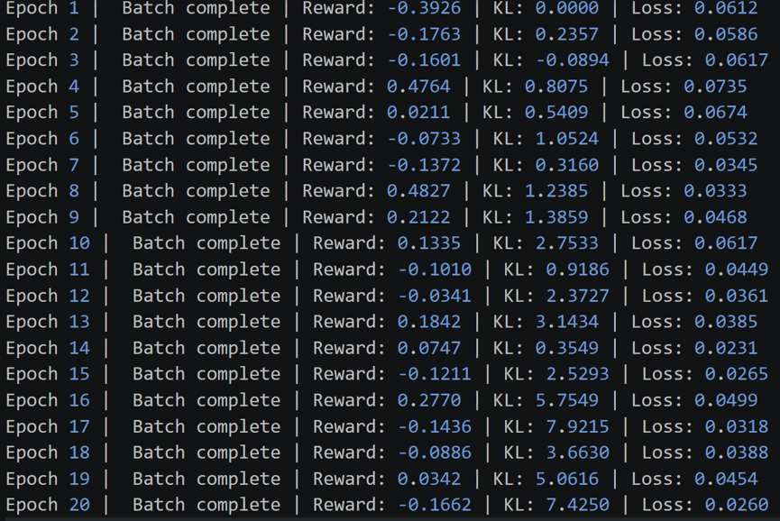

# Day21 RL 訓練血淚史：不穩定現象 (KL Explosion, Collapse) 踩坑

今天來聊聊這幾天踩的坑! 踩坑日記開始!!

### 1. 策略崩潰（Policy Collapse / Mode Collapse）
在Day18 的時候，原本的目標是設計較差的 Reward，看看是否有Reward Hacking出現。

但在過程中，發現不小心觸發另一個問題—策略崩潰。
模型發現：「算數學可以拿 10 分，但不知道怎麼拿天氣的分數。為了追求那 10 分，把所有神經元都用來輸出『100』和『台北天氣』好了！」結果它優化過頭了，連怎麼講正常的句子、怎麼寫 <final_answer> 標籤都忘了。

在經歷了前幾個 Epoch 的迷惘與扣分後，模型在 Epoch 6 處理算術題時，它成功輸出了 `<final_answer>100</final_answer>` 成功拿到了 10.0 的最高獎勵！ 

與此同時，天氣題的表現卻很不順利

雖然模型偶爾會嘗試使用 `<tool_call>` 或 `<final_answer>`，但因為天氣的答案（設定為「晴天」）很難被隨機猜中，導致它在天氣題上不管怎麼回答，幾乎都只能拿到 -1.0 的懲罰。

到了Epoch 12 開始模型徹底壞掉了，他開始忘記要使用 `<final_answer>` 或 `<tool_call>` 標籤或是毫無意義地瘋狂重複。所以Reward只拿到-1.0。

---
### 為什麼會發生「策略崩潰」？
在 PPO 訓練中，如果獎勵的起伏太大（例如這題拿 +10 分，下一題卻拿 -1 分），或者學習率（Learning Rate）設定太高，模型在反向傳播更新權重時，步子邁得太大，就會不小心破壞掉它原本預先訓練好的語言能力。

#### KL 散度（KL Divergence）爆炸

從日誌中可以看到，KL 值從 Epoch 1 的 0.0000 一路狂飆到 Epoch 20 的 7.4250，而 Reward 卻沒有穩定上升，甚至在最後幾個 Epoch 呈現負值。

這表示您的模型（Policy Model）已經與原始模型（Reference Model）偏離太遠，發生了策略崩潰。

模型可能為了迎合 Reward 函數而開始產生極度不自然的文本，或者已經喪失了原本正常的語言生成能力。

---
### Takeaway
- 認識策略崩潰 (Policy Collapse)
- 獎勵函數 (Reward Function)設計有其困難性
- 學會監控關鍵的健康指標: KL 散度 (KL Divergence)

---
明天會拿昨天的模型與 Day17 做的baseline進行比較

