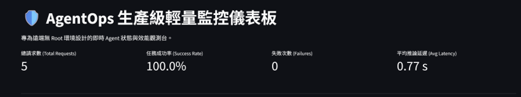
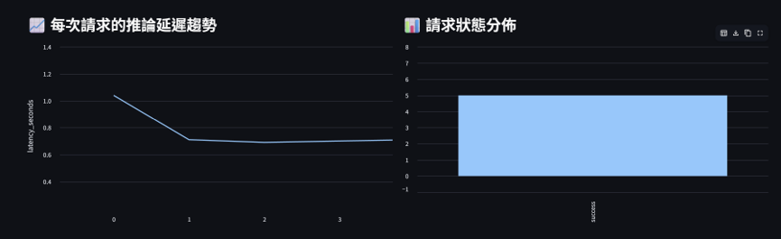
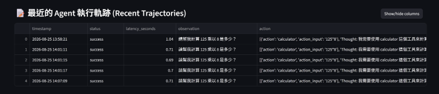
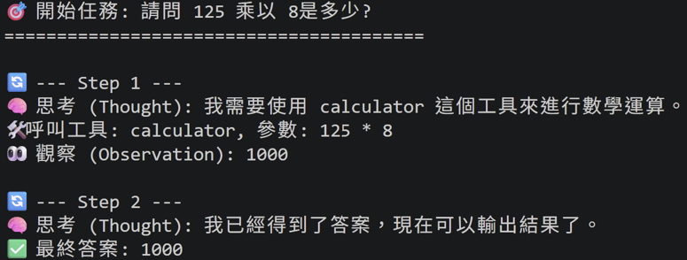
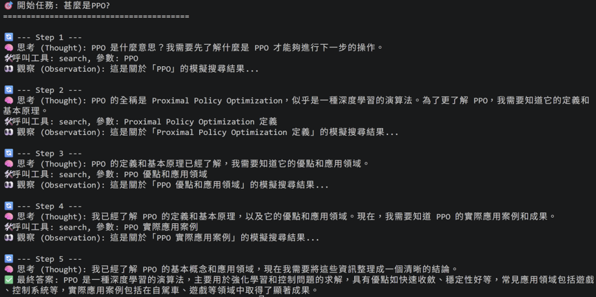
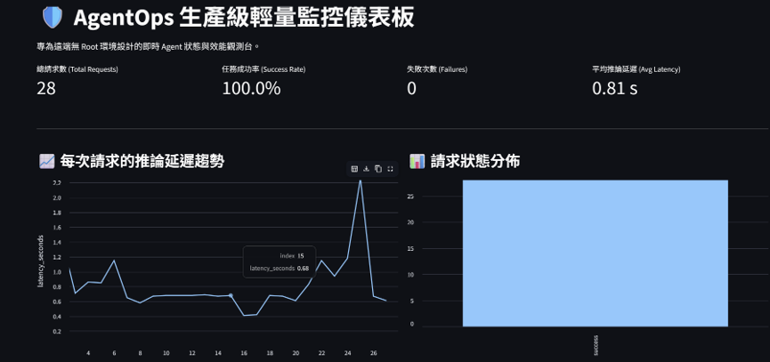
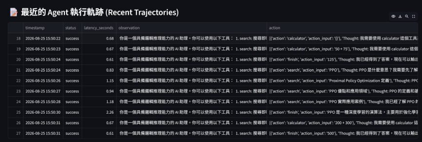

# Day27 用 Streamlit 模擬 Grafana 視覺化：建構 Agent Controller 迴圈與 API 批次測試

今天會建立 AgentOps 輕量即時監控儀表板!

實作展示了如何利用 FastAPI 輕量埋點 + JSONL 儲存 + Streamlit 儀表板，用純 Python 打造出一個具備 KPI 監控、延遲趨勢圖與即時軌跡檢視的 AgentOps 觀測系統。

### 實作即時監控儀表板
以下是我實作的即時監控儀表板，分成三個部分說明:

維護人員每天早上打開面板第一眼要看的，用來快速判斷「系統現在有沒有炸掉」。
- **總請求數 (Total Requests)**： 反映目前的系統負載量
    - 如果數字突然暴增，可能是遭受惡意攻擊或業務量大增，需要考慮Scaling
- **任務成功率 (Success Rate)**： AgentOps 最重要的指標
    - 一般 API 只要沒當機就算成功，但 Agent 必須「正確呼叫工具並給出答案」才算成功。如果跌破 95%，代表模型可能開始「幻覺」或工具壞了
- **失敗次數 (Failures)**： 直接顯示錯誤發生的頻率
    - 通常會設定Alert，例如「5 分鐘內超過 10 次失敗」就發送通知
- **平均推論延遲 (Avg Latency)**： 反映模型生成速度
    - LLM 推論本來就慢，但如果平均時間從 2 秒變成 10 秒，可能是 GPU 記憶體快滿了（OOM 前兆），或是某個外部工具（如 Search API）連線逾時

---

當發現發生錯誤時，工程師會立刻來到這區，檢視 observation（使用者的原始問題）和 action（Agent 的回答）。藉此判斷是「Prompt 沒寫好」、「模型真的笨」，還是「外部工具的格式改版導致解析失敗」。

---
### 實驗發送的問題

---
### 那一次問很多問題?
接下來要寫一支 Python Client 測試腳本，模擬發送多個任務請求，並誠實記錄單次呼叫的推論延遲 (Inference Latency)。

這次我們連續問10個問題

---
明天我們要來處理萬一agent 出錯，要如何修正他?
